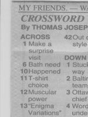
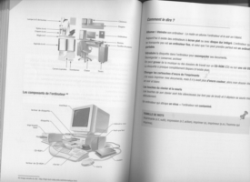

# [Bitcrasher](https://github.com/ImageProcessing-ElectronicPublications/bitcrasher) samples

Text and background separation algorithm for `pgm` images.

### Example

### [Test images](images/original)

2017
